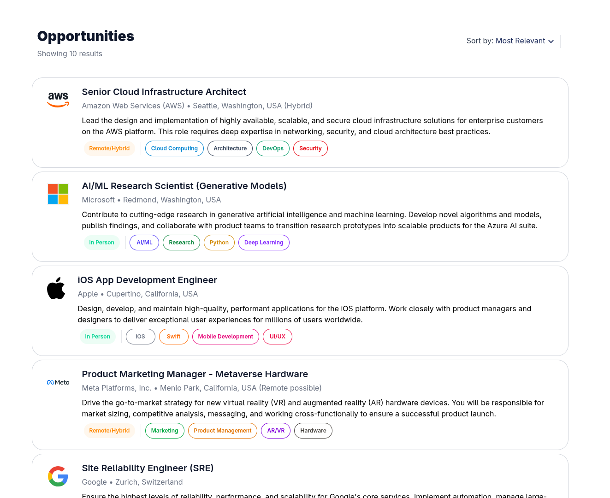
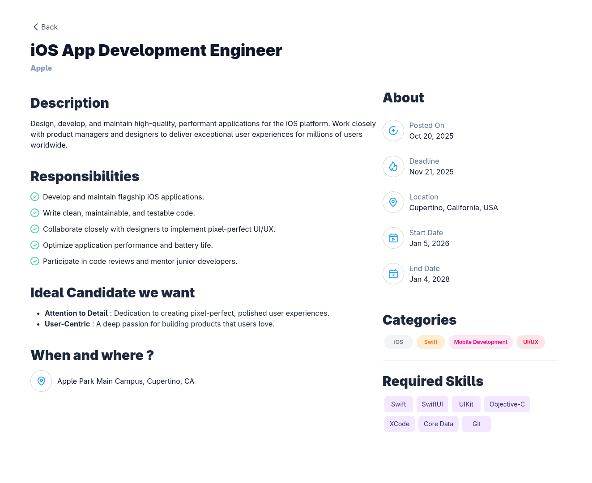

# A2SV Job Listing App

Small job-listing web app built with Next.js, React and Tailwind CSS. Data is loaded from a local JSON file (data/jobs.json). The app lists job offers and provides a details view showing full descriptions.

## Features
- List jobs (title, company, location, tags)
- Job details page with full description and meta
- Client-side navigation with Next.js
- Tailwind CSS for styling
- Data retrieved from an API
- Smooth loading of pages

## Tech
- Next.js (React)
- Tailwind CSS
- Plain JSON for seed data

## Quickstart
Prerequisites: Node.js (16+), npm or yarn.

1. Clone
    - git clone https://github.com/SpeedCode210/A2SV-webdev-job-listing-app.git
    - cd A2SV-webdev-job-listing-app

2. Install
    - npm install
    - or
    - yarn

3. Run dev server
    - npm run dev
    - open http://localhost:3000

4. Build & start
    - npm run build
    - npm start

## Tasks Progress (Following the webdev track roadmap)
- [x] Task 6
- [x] Task 7
- [ ] Task 8
- [ ] Task 9

## Screenshots
### Task 6

